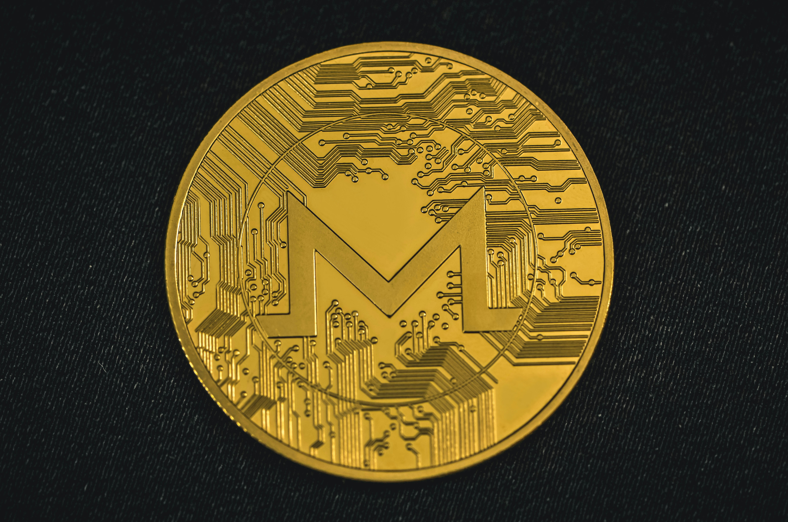

# Monero

Hi gig

## Videos to start

- What is Monero?  
https://youtu.be/B7sLnmlZ-kU?si=q1NtovBIuB7Wc72n

- Why is it 'better' than bitcoin?  
https://youtu.be/QrHsFZBab4U?si=mkgDwoQFiTXfvqXg

## To read

- What is Monero (from official site)  
    https://www.getmonero.org/get-started/what-is-monero/
- Official source code (advanced, maybe a skip..)  
    https://github.com/monero-project/monero

## On the privacy...

- https://monero.garden/3-notes-for-humans/trying_things
- https://www.privacyguides.org/en/advanced/payments/
- https://www.privacyguides.org/en/basics/why-privacy-matters/

## Tutorial 

- https://monero.garden/1-manual-for-users/get_started
- https://www.privacyguides.org/en/cryptocurrency/?h=monero

## Articles..

- https://web.archive.org/web/20180301193715/https://www.wired.com/2017/01/monero-drug-dealers-cryptocurrency-choice-fire/
- https://web.archive.org/web/20180401171522/https://www.wired.com/story/bitcoin-drug-deals-silk-road-blockchain/

## To remember

- Almost every crypto project is a scam, an easy way for unethical people to make quick money.
- On the Internet, anonymity is a myth.
- The blockchain revolution promised decentralization but delivered new forms of centralized power.  
e.g. :  
    - Mining pools:  
        Mining is concentrated in few large mining pools, e.g. before 2021 in China:  
        https://cryptonomist.ch/2022/01/18/bitcoin-great-mining-migration/

    - Whale concentration:  
        Small number of wallets hold very dispoportionate amounts of many cryptos. (Top 10000 Bitcoin holders controlled about 27% of all Bitcoin, source https://www.nber.org/system/files/working_papers/w29396/w29396.pdf)
    - Exchanges:  
        There is 0 decentralization in centralized exchanges like Binance, Coinase and the now incrimanated FTX.  
        They all represent single points of failure. The opposite of decentralization.

